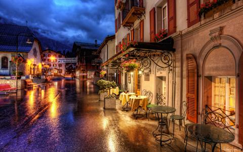
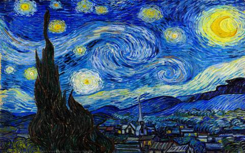
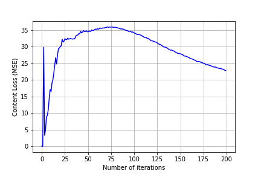
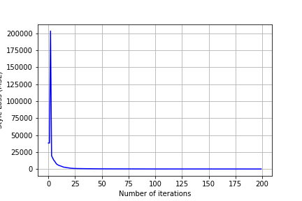
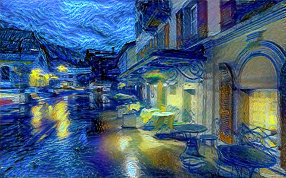
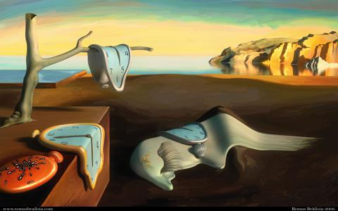
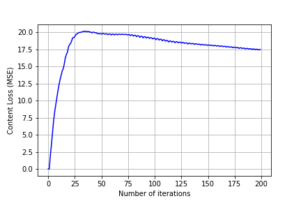
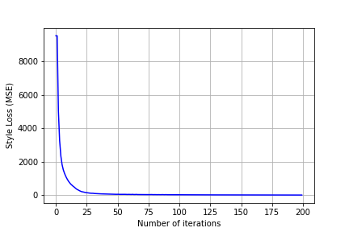
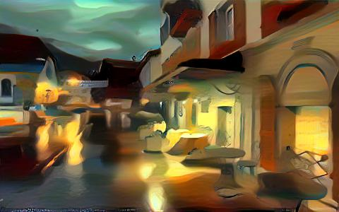

NeuralStyleTransfer
======================
A Neural Style Transfer based on VGG19 model

:star: Star this project on GitHub — it helps!

[Neural Style Transfer](https://arxiv.org/pdf/1705.04058.pdf) is a task of transferring style
of one image to another. It does it by using features of some pretrained model. In this
case as such **Base Model** the **VGG19** pretrained on **ImageNet** was used. 
Firstly we create our own model from certain layers of the **VGG19** network.
And then by adding gradients from the network to the input image we obtain our result image
with transferred style.

## Table of content

- [Compiling model](#compile)
- [Training](#train)
- [Results](#res)
- [License](#license)
- [Links](#links)

## Compiling model (#compile)

As mentioned above, first of all we should compile our model from pretrained one.
In this particular case the **VGG19** was used. We should define between which of
the layers the `Content loss` and `Style loss` are going to be calculated.
As model's input is going to be the copy of *content_image* we do not need so much
*nodes* to calculate `Content loss` as we need for `Style loss`(In this case **1 node**
was used for `Content loss` and **5 nodes** for `Style loss`.
* The model compiler is under `model/__init__.py`.

## Training (#train)

Parameters of training:
- Base model: **VGG19**
- Content loss layer: `conv4`
- Style loss layers: (`conv1`, `conv2`, `conv3`, `conv4`, `conv5`)
- **LBFGS** optimizer
- Number of epochs: 10

See [demo](https://github.com/akanametov/NeuralStyleTransfer/blob/main/demo/demo.ipynb) for more details of training process.
* The model trainer is under `trainer.py`.
### Results (#res)
### `Van Gogh` style
#### Content Image

#### Style Image

##### Content loss

##### Style loss

#### Result

### `Dali` style
#### Content Image

#### Style Image

##### Content loss

##### Style loss

#### Result

## License (#license)

This project is licensed under MIT.

## Links (#links)

* [Neural Style Transfer (arXiv article)](https://arxiv.org/pdf/1705.04058.pdf)
